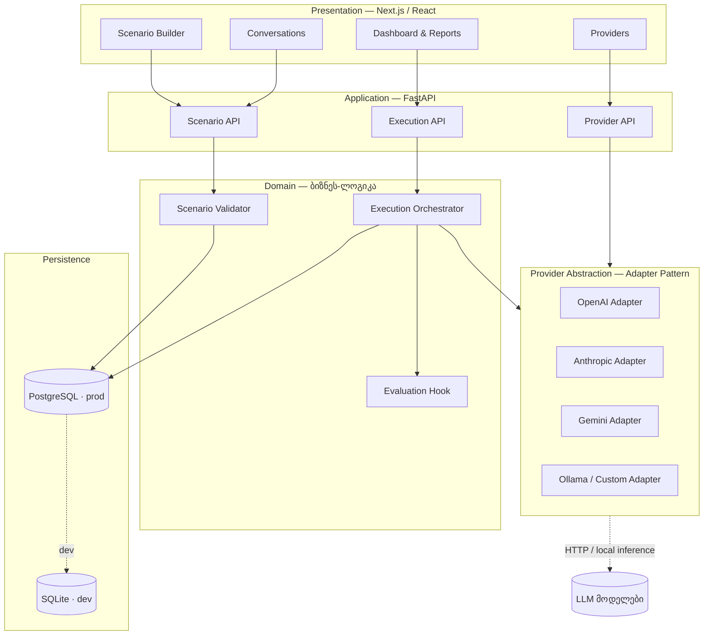
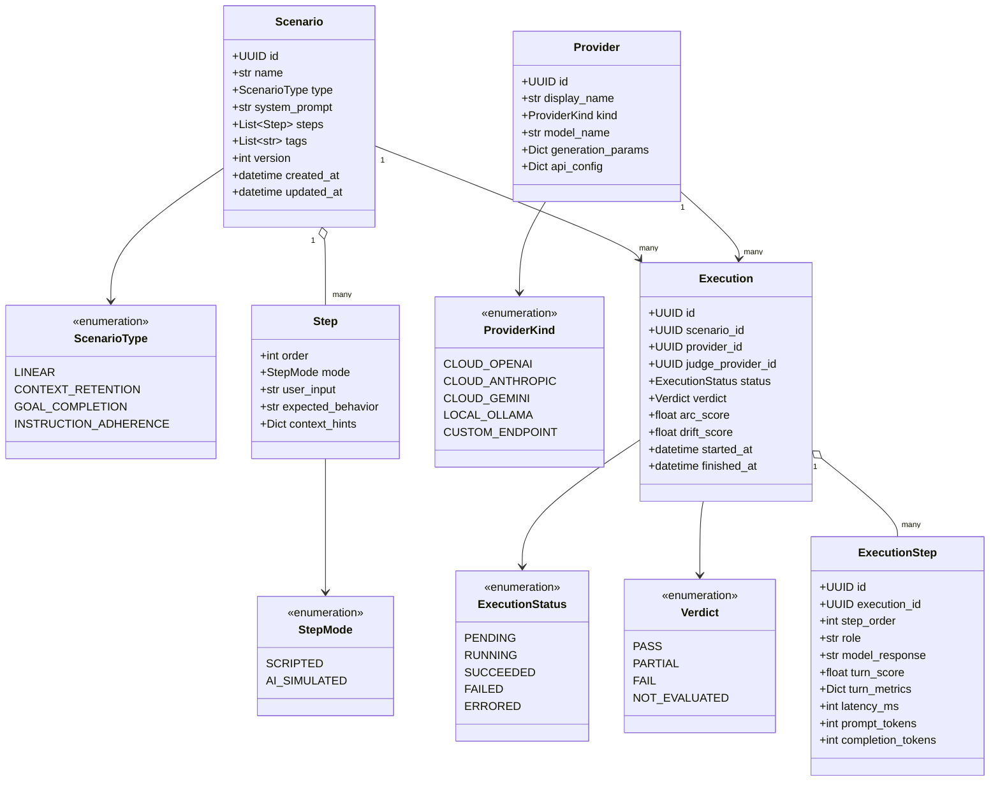
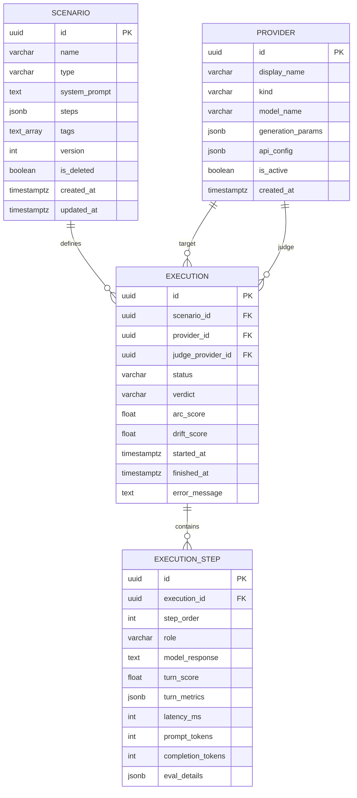

## 2. სისტემის ლოგიკური არქიტექტურა

პლატფორმა აიგება **ხუთშრიანი (Layered)** არქიტექტურით. ეს მიდგომა უზრუნველყოფს ბიზნეს-ლოგიკის იზოლაციას LLM პროვაიდერებისგან.

---

## 3. ობიექტების მოდელი (Domain Model)

სისტემის მონაცემთა მოდელი აგებულია სამი ძირითადი სუბიექტის გარშემო: **Scenario**, **Provider** და **Execution**.

### 3.1. კომპონენტების აღწერა
*   **Scenario (სცენარი):** ტესტის აღწერა. მხარს უჭერს `SCRIPTED` (ფიქსირებული) და `AI_SIMULATED` (სიმულირებული მომხმარებელი) ნაბიჯებს.
*   **Provider (პროვაიდერი):** LLM ენდპოინტების აბსტრაქცია. ერთი გაშვებისას შეიძლება იყოს როგორც **Target** (ტესტირებადი), ისე **Judge** (შემფასებელი).
*   **Execution (შესრულება):** კონკრეტული ტესტ-გაშვების სრული ჩანაწერი. `arc_score` ზომავს კონვერსაციის ჯამურ ხარისხს, ხოლო `drift_score` — ხარისხის ვარდნას დროთა განმავლობაში.

---

## 4. მონაცემთა ბაზის სქემა (ERD)

---

## 5. API კონტრაქტი (Endpoints)

სისტემასთან ინტერაქცია ხდება RESTful API-ს მეშვეობით, რაც უზრუნველყოფს ტესტების ასინქრონულ მართვას.

1. Scenarios (სცენარები)
POST /scenarios — ახალი სატესტო სცენარის შექმნა.

GET /scenarios — ყველა სცენარის სია და ფილტრაცია.

GET /scenarios/{id} — კონკრეტული სცენარის სრული სტრუქტურა.

PUT /scenarios/{id} — სცენარის რედაქტირება (ახალი ვერსია).

DELETE /scenarios/{id} — სცენარის არქივაცია (Soft-delete).

2. Executions (ტესტების გაშვება)
POST /executions — ტესტირების პროცესის ინიციირება.

GET /executions/{id} — სტატუსის და arc/drift ქულების ნახვა.

GET /executions/{id}/steps — დიალოგის თითოეული ნაბიჯის დეტალები.

GET /executions — ჩატარებული ტესტების ისტორია.

3. Providers (პროვაიდერები)
POST /providers — ახალი LLM მოდელის რეგისტრაცია.

GET /providers — ხელმისაწვდომი მოდელების სია.

POST /providers/{id}/health — API კავშირის და სისწრაფის შემოწმება.

4. Analytics (ანალიტიკა)
GET /analytics/dashboard — წარმატების მაჩვენებლების ჯამური სტატისტიკა.